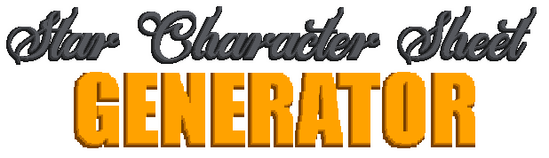

 

  

# Welcome to SCSG!
The **Star Character Sheet Generator (SCSG)** is a free, simple, and fast utility designed to bring your characters to life in your stories, whether for books, RPGs, scripts, and more.

# What makes SCSG special?
The main purpose of this application is to provide a dynamic and customizable way to create character sheets. Shaping foundations for fictional characters according to your preferences, SCSG makes the process of developing engaging characters easy, fast, secure, and dynamic.

# How to Access SCSG
To start using SCSG, visit our website by clicking [here](https://starciad.github.io/SCSG/).

# Contributors
This project is a solo initiative, developed and maintained entirely by [Starciad](https://github.com/Starciad). Explore the profile to discover more interesting projects and feel free to contribute or report issues.

**Let's create amazing characters together!**